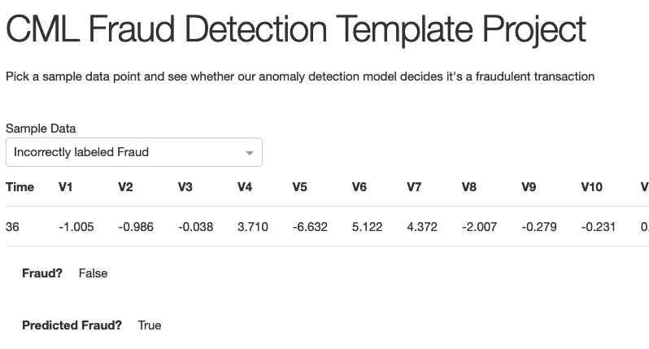

# Fraud Detection Prototype
This project is a Cloudera Machine Learning 
([CML](https://www.cloudera.com/products/machine-learning.html)) **Applied Machine Learning 
Project Template**. It has all the code and data needed to deploy an end-to-end machine 
learning project in a running CML instance and provides practice using the features of CML
that empower data scientists in solving problems similar to this one.

*screenshot of the Fraud Detection App:*


## Project Overview
In this use case, a fictional credit card company uses machine learning to
**identify fraudulent transactions** that should be blocked or investigated.
Although the features in this dataset are abstract, in principle,
post hoc analysis could also surface fraud hotspots that could be
communicated as an alert to customers.
The techniques in this use case are applicable to any situation in which
most measurements or events are normal, but rare outliers require attention.

This project covers all the steps of such a workflow, ultimately producing an API to serve 
real-time predictions and a basic webapp as a first step towards providing immediate business 
value.

This project uses the now-classic [credit card fraud dataset](https://www.kaggle.com/isaikumar/creditcardfraud)
presented in the Fast Forward Labs Deep Learning for Anomaly Detection report
([freely available](https://ff12.fastforwardlabs.com)).
The report covers more sophisticated techniques and advanced discussion for solving anomaly detection 
problems like this one.

### Initialize the Project
There are a couple of steps needed at the start to configure the Project and Workspace 
settings so each step will run successfully. You **must** run the project bootstrap 
before running other steps. If you just want to launch the model interpretability 
application without going through each step manually, then you can also deploy the 
complete project. 

***Project bootstrap***

Open the file `0_bootstrap.py` in a normal workbench python3 session. You need a 
2 vCPU / 4 GiB instance. Once the session is loaded, click **Run > Run All Lines**. 
This will file will create an Environment Variable for the project called **STORAGE**, 
which is the root of default file storage location for the Hive Metastore in the 
DataLake (e.g. `s3a://my-default-bucket` or `abfs://my-name@mystorage.dfs.core.windows.net`). 
It will also upload the data used in the 
project to `$STORAGE/datalake/data/churn/`. The original file comes as part of this 
git repo in the `raw` folder.

***Deploy the Complete Project***

If you just wish build the project artifacts without going through each step manually, 
run the `6_build_projet.py` file in a python3 session. Again a 1 vCPU / 2 GiB instance 
will be sufficient. This script will: 
* run the bootstrap
* then create the Hive Table and import the data
* deploy the model
* update the application files to use this new model
* deploy the application
Once the script has completed you will see the new model and application are now available 
in the project.

## Project Build
If you want go through each of the steps manually to build and understand how the project 
works, follow the steps below. There is a lot more detail and explanation/comments in each 
of the files/notebooks so its worth looking into those. Follow the steps below and you 
will end up with a running application.

### 0 Bootstrap
Just to reiterate that you have run the bootstrap for this project before anything else. 
So make sure you run step 0 first. 

Open the file `0_bootstrap.py` in a normal workbench python3 session. You will need a 
2 CPU / 4 GB instance. Then **Run > Run All Lines**

### 1 Ingest Data
This script will read in the data csv from the file uploaded to the object store (s3/adls) setup 
during the bootstrap and create a managed table in Hive. This is all done using Spark.

Open `1_data_ingest.py` in a Workbench session: python3, 1 CPU, 2 GB. Run the file.

### 2 Model Building
This is where we start to test how well an anomaly detection model can flag cases of fraud,
while not flagging legitimate transaction.
It's important to intervene in the right cases, but blocking too many legitimate transactions annoys customers.

_**Note:**_ This Prototype can use GPUs to accelerate the model training. The code will automatically use GPUs if cuda is 
available. If you want to use GPU, please following [these instructions](https://docs.cloudera.com/machine-learning/cloud/gpu/topics/ml-gpu.html) to add a GPU compatible engine.

Open a Jupyter Notebook session (rather than a work bench): python3, 1 CPU, 2 GB (and 1 GPU if applicable) and
open the `	3_model_building.ipynb` file. 

At the top of the page click **Cells > Run All**.

### 3 Model Training
A pre-trained model and transformer has been saved with the repo has been and placed in the `model` directory. 
If you want to retrain the model, open the `3_model_train.py` file in a workbench session: 
python3 1 vCPU, 2 GiB (and 1 GPU if applicable) and run the file. The newly trained model will be saved in the `model` directory. 

There are 2 other ways of running the model training process

***1. Jobs***

The **[Jobs](https://docs.cloudera.com/machine-learning/cloud/jobs-pipelines/topics/ml-creating-a-job.html)**
feature allows for adhoc, recurring and depend jobs to run specific scripts. To run this model 
training process as a job, create a new job by going to the Project window and clicking _Jobs >
New Job_ and entering the following settings:
* **Name** : Train Model
* **Script** : 3_model_train.py
* **Arguments** : _Leave blank_
* **Kernel** : Python 3
* **Schedule** : Manual
* **Engine Profile** : 1 vCPU / 2 GiB (/ 1 GPU if applicable)
The rest can be left as is. Once the job has been created, click **Run** to start a manual 
run for that job.

***2. Experiments***

The other option is running an **[Experiment](https://docs.cloudera.com/machine-learning/cloud/experiments/topics/ml-running-an-experiment.html)**. Experiments run immediately and are used for testing different parameters in a model training process. In this instance it would be use for hyperparameter optimisation. To run an experiment, from the Project window click Experiments > Run Experiment with the following settings.
* **Script** : 3_model_train.py
* **Arguments** : 256 0.01 100 _(these are the batch_size, lr and num_epochs parameters to be passed to the pytorch model)_
* **Kernel** : Python 3
* **Engine Profile** : 1 vCPU / 2 GiB (/ 1 GPU if applicable)

Click **Start Run** and the expriment will be sheduled to build and run. Once the Run is 
completed you can view the outputs that are tracked with the experiment using the 
`cdsw.track_metrics` function. It's worth reading through the code to get a sense of what 
all is going on.

### 4 Serve Model
The **[Models](https://docs.cloudera.com/machine-learning/cloud/models/topics/ml-creating-and-deploying-a-model.html)** 
is used top deploy a machine learning model into production for real-time prediction. To 
deploy the model trailed in the previous step, from  to the Project page, click **Models > New
Model** and create a new model with the following details:

* **Name**: Fraud Detection
* **Description**: Deep Anomaly Detection for Fraud
* **File**: 4_model_deploy.py
* **Function**: predict
* **Input**: 
```
{
  "v": [
    -1.3598071336738,
    -0.0727811733098497,
    2.53634673796914,
    1.37815522427443,
    -0.338320769942518,
    0.462387777762292,
    0.239598554061257,
    0.0986979012610507,
    0.363786969611213,
    0.0907941719789316,
    -0.551599533260813,
    -0.617800855762348,
    -0.991389847235408,
    -0.311169353699879,
    1.46817697209427,
    -0.470400525259478,
    0.207971241929242,
    0.0257905801985591,
    0.403992960255733,
    0.251412098239705,
    -0.018306777944153,
    0.277837575558899,
    -0.110473910188767,
    0.0669280749146731,
    0.128539358273528,
    -0.189114843888824,
    0.133558376740387,
    -0.0210530534538215
  ],
  "time": 0,
  "amount": 149.62
}
```
* **Kernel**: Python 3
* **Engine Profile**: 1vCPU / 2 GiB Memory (**Note:** no GPU needed for scoring)

Leave the rest unchanged. Click **Deploy Model** and the model will go through the build 
process and deploy a REST endpoint. Once the model is deployed, you can test it is working 
from the model Model Overview page.

_**Note: This is important**_

Once the model is deployed, you must disable the additional model authentication feature. In the model settings page, untick **Enable Authentication**.

``

### 5 Deploy Application
The next step is to deploy the Dash application. This uses the 
**[Applications](https://docs.cloudera.com/machine-learning/cloud/applications/topics/ml-applications.html)** feature 
in CML. For this project [Dash](https://plotly.com/dash/) is used to build web based application that interacts with 
the underlying model created in the previous step.

_**Note: This next step is important**_

_In the deployed model from step 5, go to **Model > Settings** and make a note (i.e. copy) the 
"Access Key". It will look something like this (ie. mukd9sit7tacnfq2phhn3whc4unq1f38)_

_From the Project level click on "Open Workbench" (note you don't actually have to Launch a 
session) in order to edit a file. Select the `5_application.py` file and paste the Access 
Key in at line 100._

`access_key = "mp3ebluylxh4yn5h9xurh1r0430y76ca"`

_Save the file (if it has not auto saved already) and go back to the Project._

From the Go to the **Applications** section and select "New Application" with the following:
* **Name**: Fraud Detection App
* **Subdomain**: fraud-app _(note: this needs to be unique, so if you've done this before, 
pick a more random subdomain name)_
* **Script**: 5_application.py
* **Kernel**: Python 3
* **Engine Profile**: 1vCPU / 2 GiB Memory

After the Application deploys, click on the blue-arrow next to the name. This will open the Dash application and let
you interact with the deployed model to see what predictions are made for different data samples.


